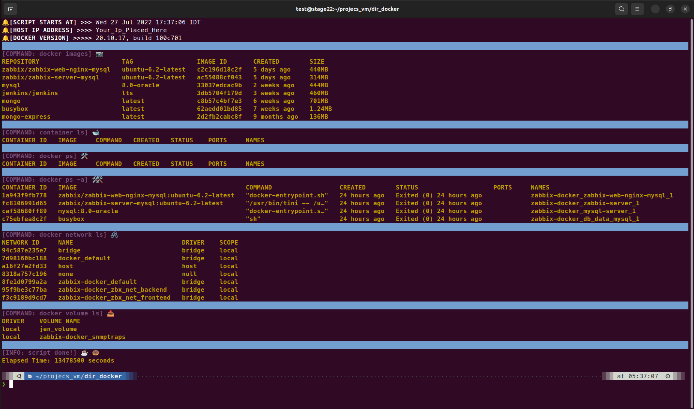

# docker_show.sh - Simple bash script 🐳

This simple script will provide an output of:

-purple)

<!--
- Docker Images List 📷
- Containers List 🐋
- Docker Ps 🛠
- Docker Ps With a 🛠🛠
- Docker Network 🖇
-->

# How to use docker_show ?

1. git clone the file
2. enter to docker_show directory by `cd docker_show`
3. make the file executible by `chmod +x docker_show.sh`
4. launch the script by the command `./docker_show.sh`
5. take a bite from your donut and a little sip from you coffee 🍩 ☕

# Replace default colors

- the default colors that enabled in the script are Blue lines with Yellow content
- under `represent the lines color` commentout the default one, and uncommented the other color that you want
- under `horizontally stretched line color` commentout the default one, and uncommented the other color that you want
- under `table content area` make sure to replace the color code name as well

The default enabled colors are:
- under `represent the lines color` the enabled color is `blue_line=`
- under `horizontally stretched line color` the `echo` point to `{blue_line}`

There Are 2 more colors available inside the script:

- Red = `#red_line="\e[0;101m${stretch_line}"` | `#echo -e "${red_line}${stop}"`
- Green = `#green_line="\e[0;102m${stretch_line}"` | `#echo -e "${green_line}${stop}"`

**INFO-1:** I didn't added more colors code to the table content, because i find out that Yellow color has a good contrast. In some cases the colors will be a bit different - it depends on your terminal color scheme settings.

**INFO-2:** By the default the block of code that printing out the IP addresses in the docker table is defined to Ubuntu-Based Linux Systems.
If you are working with Arch-Based Linux Systems, please edit the script, comment-out the entire block of code that belongs to Ubuntu-Based Linux Systems, and Uncomented the block of code below, that intended to Arch-Based Linux Systems.

**IMPORTANT:** make sure to leave `stretch_line` and `stop="\e[0m"` uncommented - comment them out will break the colors

# Linux distros 🐧

- this script will work on any linux distro in town
- make sure to run this script on the docker host machine
- for a better view, stretch your terminal a bit
- recommended stretch size: 140x40 (fullscreen is even a better choice)
- you can verify the size by the command `tput cols && tput lines`

# About this repo ⬆️

also imported to [free-doughnuts](https://gitlab.com/free-doughnuts/docker_show) account on GitLab
